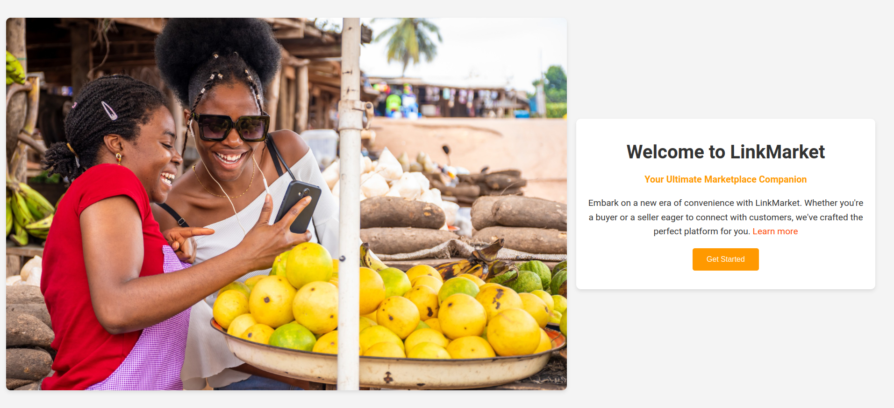

 

# Django LinkMarket Application

Welcome to the Django LinkMarket application! This project is a web application built with Django for managing products and orders between buyers and sellers.

## Overview
The Django LinkMarket application is designed to facilitate interactions between buyers and sellers. Sellers can create and manage their businesses, add products and fulfill orders. Buyers can browse businesses and products, add items to their cart, and complete purchases.

## Features
- **Authentication and Authorization**: Users can sign up, log in and manage their accounts with different roles (buyer or seller).
- **Business Management**: Sellers can create and manage their businesses, including adding details and uploading business logos.
- **Product Management**: Sellers can add, edit and delete products, including images, descriptions and prices.
- **Shopping Cart**: Buyers can add products to their cart, update quantities and proceed to checkout.
- **Order Management**: Sellers can view orders, update order statuses and mark orders as fulfilled.
- **Responsive Design**: The application is designed to be responsive across different devices and screen sizes.

## Setup Instructions
To run this Django application locally follow these steps:

1. **Clone the repository:**

    <pre><code>
    git clone  https://github.com/Caleb-ne1/LinkMarket.git
    </code></pre>

2. **Create a virtual environment (optional but recommended):**

    <pre><code>
    python -m venv env
    </code></pre>

3. **Install dependencies:**

    <pre><code>
    pip install -r requirements.txt
    </code></pre>

4. **Configure Django to Use the MySQL Database:**

    <pre><code>
    DATABASES = {
    'default': {
        'ENGINE': 'django.db.backends.mysql',
        'NAME': 'linkmarket',  # Name of the database you created
        'USER': 'root',  # Default XAMPP username
        'PASSWORD': '',  # Default XAMPP password is empty
        'HOST': 'localhost',
        'PORT': '3306',
    }
}

    </code></pre>

5. **Apply database migrations:**

    <pre><code>
    python manage.py makemigrations
    python manage.py migrate
    </code></pre>

6. **Run the development server:**

    <pre><code>
    python manage.py runserver
    </code></pre>

7. **Open the application on your browser:**

    <pre><code>
    http://127.0.0.1:8000/LinkMarket
    </code></pre>

